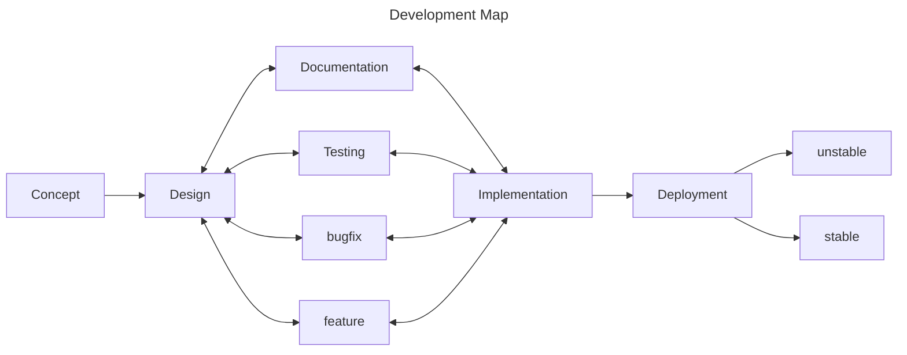

  <h1
    style="font-size: 3rem; font-weight: bold;"
    >
    Development Map
  </h1>

## Introduction

Development Map for publishing developed packages to apt repositories. This is a work in progress and will be updated as weeekly progress.

### Goals

- Standardize the development process for publishing packages to apt repositories.
- Automate the process of publishing packages to apt repositories.
- Create an interactive process for publishing packages to apt repositories.
- Provide a clear and concise documentation for the development process.

## Contributing

Contributions are welcome! Please read the [CONTRIBUTING](CONTRIBUTING.md) file for more information on how to contribute to this project.

## Code of Conduct

Please read the [CODE OF CONDUCT](CODE-OF-CONDUCT.md) file for more information on our code of conduct.

## Documentation

Please read the [DOCUMENTATION](doc/README.md) file for more information on how to use this project.
